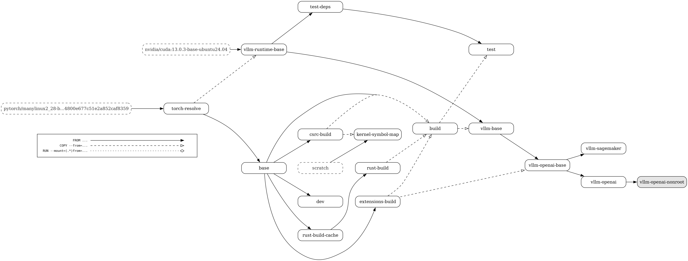

# Dockerfile

We provide a [docker/Dockerfile](../../../docker/Dockerfile) to construct the image for running an OpenAI compatible server with vLLM.
More information about deploying with Docker can be found [here](../../deployment/docker.md).

## CUDA dependency selection

`CUDA_VERSION` selects the PyTorch CUDA index and runtime toolkit. Supply a
matching `BUILD_BASE_IMAGE` when changing its major/minor: the default builder
is independently pinned. The build checks that `nvcc`, `torch.version.cuda`,
and the requested CUDA major/minor agree.

The `torch-resolve` stage resolves Torch, TorchVision, TorchAudio, and TorchCodec
together, binding them to the selected PyTorch index. Versions come from the
existing requirements files. `PYTORCH_NIGHTLY=1` selects nightly wheels;
`INSTALL_RUBIN_PRERELEASE=true` uses the architecture-specific Rubin pins and
takes precedence. `PYTORCH_CUDA_INDEX_BASE_URL` also applies to these channels.
Ordinary dependencies remain available from PyPI or the configured mirrors.

Both build and runtime stages consume the selected wheel URLs as constraints.
Later dependency installs fail if they require a different protected wheel.
Development/test requirements are recompiled for the selected stack, retaining
compatible preferences from the checked-in lock. `UV_CONSTRAINT` and
`UV_BUILD_CONSTRAINT` are build arguments, so this policy does not change
installation behavior in derived images or running containers.

This contract does not require every CUDA-related dependency to share a toolkit
version. FlashInfer distribution, CUDA-specific extras, NCCL overrides, and
source-built Triton/NIXL retain their own selection rules. Source provenance
also does not replace import checks or GPU validation.

## Build stages

Below is a visual representation of the multi-stage Dockerfile. The build graph contains the following nodes:

- All build stages
- The default build target (highlighted in grey)
- External images (with dashed borders)

The edges of the build graph represent:

- `FROM ...` dependencies (with a solid line and a full arrow head)

- `COPY --from=...` dependencies (with a dashed line and an empty arrow head)

- `RUN --mount=(.\*)from=...` dependencies (with a dotted line and an empty diamond arrow head)

The `test-deps` stage branches from `vllm-runtime-base` so Git and the test
requirements remain cached independently of per-commit vLLM wheels and source.
`base` and `vllm-runtime-base` share the small `torch-resolve` output; runtime
dependency installation does not wait for native compilation.

The `extensions-build` stage can also produce an optional source-built Triton
wheel. `vllm-openai-base` installs that wheel after its other Python
dependencies so dependency resolution cannot restore an older Triton version.

With `BUILD_NIXL=true`, `extensions-build` also builds NIXL, including its NIXL
EP extension for the installed PyTorch, with `tools/build_nixl_with_torch215_for_rubin.py`.
`vllm-openai-base` then replaces the NIXL packages installed from the KV-connector
requirements with these wheels.

  > <figure markdown="span">
  >   { align="center" alt="query" width="100%" }
  > </figure>
  >
  > Made using: <https://github.com/patrickhoefler/dockerfilegraph>
  >
  > Commands to regenerate the build graph (make sure to run it **from the \`root\` directory of the vLLM repository** where the dockerfile is present):
  >
  > ```bash
  > dockerfilegraph \
  >   -o png \
  >   --concentrate \
  >   --legend \
  >   --dpi 200 \
  >   --max-label-length 50 \
  >   --filename docker/Dockerfile
  > ```
  >
  > or in case you want to run it directly with the docker image:
  >
  > ```bash
  > docker run \
  >    --rm \
  >    --user "$(id -u):$(id -g)" \
  >    --workdir /workspace \
  >    --volume "$(pwd)":/workspace \
  >    ghcr.io/patrickhoefler/dockerfilegraph:alpine \
  >    --output png \
  >    --dpi 200 \
  >    --max-label-length 50 \
  >    --filename docker/Dockerfile \
  >    --concentrate \
  >    --legend
  > ```
  >
  > (To run it for a different file, you can pass in a different argument to the flag `--filename`.)
